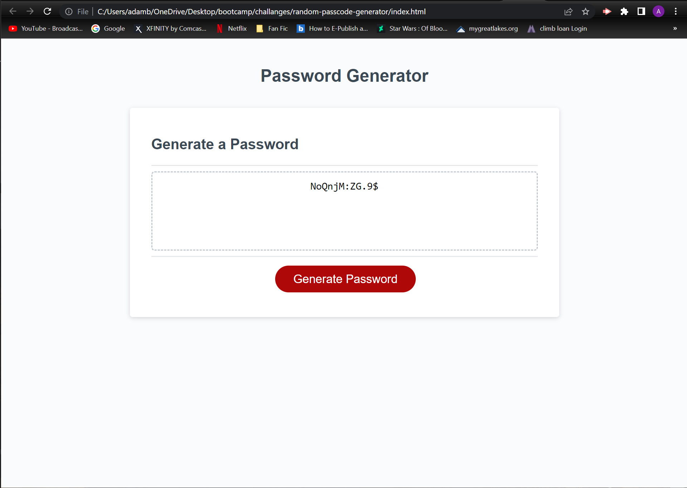

# random-passcode-generator

## Description

- An employee requested that we develop a password generator do to the sensitive nature of thier infomation.
- After be provided with the base JS, HTML, and CSS code to have application run I was left with providing the actual password generation.
- After building a array build by the specification of future users A worked to develop a QC code to ensure no mater what the clients inputs would be used.
- Through this I learned how essental while loops can be for QC of code generation and the compartmentalizing of code and how to properly add sucsessive arrays together.
- Though I still want to work on it and further my understanding of while loops to create a more seemless product.

## Table of Contents 

- [Installation](#installation)
- [Usage](#usage)
- [Credits](#credits)
- [License](#license)

## Installation

[horiseon splash page](https://crowtrooper202.github.io/random-passcode-generator/)

## Usage

the page uses links at the top pf the page for easy navigation.

## Credits

N/A

## License

N/A
